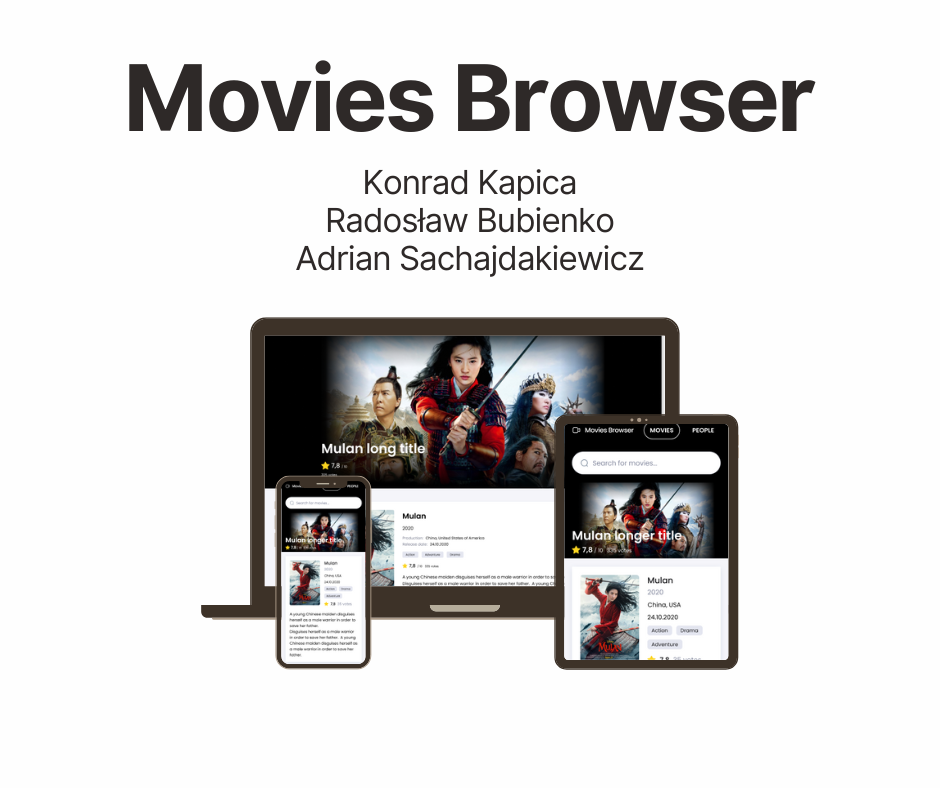

# Movies Browser - Group Project

## Contributors:
- Konrad Kapica(konradkapica)
- Radosław Bubienko(RadekBubienko)
- Adrian Sachajdakiewicz(adrianSACHA)

This project was bootstrapped with [Create React App](https://github.com/facebook/create-react-app).

## Table of content
1. Demo
1. Preview
1. Description
1. Technologies
1. Getting started

## DEMO
[Application Demo](https://adriansacha.github.io/movies-browser/)

## PREVIEW

## Description
Building this site in Group Project according to a project designed in Figma. Working in Scrum.

## Technologies used in project
- `React`
- `Redux(toolkit)`
- `Redux-Saga`
- `React-Router`
- `JS/ES6+`
- `HTML`
- `CSS`
- `BEM`
- `Flex/Grid`
- `Transition`
- `Media query`
- `Styled Components`
- `GlobalStyles & Theme`
- `API`

## Available Scripts
In the project directory, you can run:

### `npm start`
Runs the app in the development mode.\
Open [http://localhost:3000](http://localhost:3000) to view it in your browser.

The page will reload when you make changes.\
You may also see any lint errors in the console.

### `npm run build`
Builds the app for production to the `build` folder.\
It correctly bundles React in production mode and optimizes the build for the best performance.

The build is minified and the filenames include the hashes.\
Your app is ready to be deployed!
